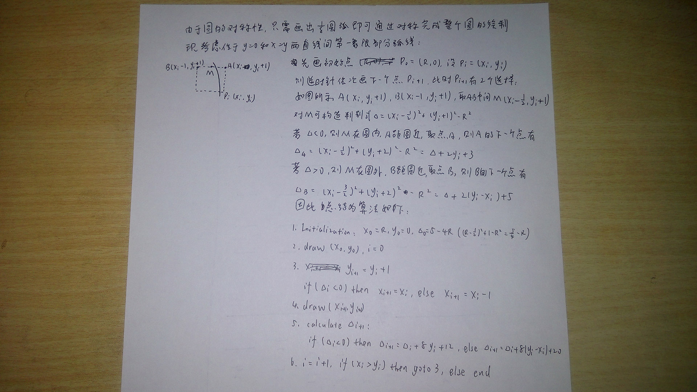

# Bresenham算法画圆

## 算法推导

算法推导原先用纸笔写过，所以就拍照显示一下了，而且也不知道GitHub的Markdown对数学公式的支持如何，以后哪天闲得慌再改成Markdown吧

## 代码实现

C++实现位于 [BresenhamForCircle.cpp](../practice/PracticeInVS2017/BresenhamForCircle/BresenhamForCircle.cpp)

